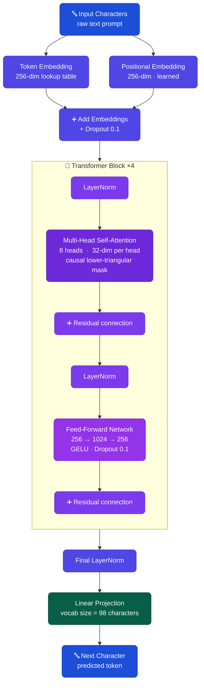

<div align="center">

# 🏛️ Dáil LLM: Irish Parliamentary Transformer

**A character-level language model trained from scratch on Irish parliamentary debate.**

The offline research pipeline adds reproducible training, speech-memory inspection,
and evaluation across historical periods. See [the research guide](docs/research.md)
for the CPU pilot, full-study commands, and cited experimental methods. Its results
and checkpoints are separate from the application described below.

The [Research interface guide](docs/research-ui.md) covers recorded examples,
optional live inspection, and deployment configuration. The
[verification record](docs/ui-verification.md) lists the checks and their limits.

[](https://python.org)
[](https://pytorch.org)
[](https://dail-llm.vercel.app/)
[](.)
[](.)

<br/>

*Dáil Éireann · Harvard Dataverse · 6 MB subset · Built on CPU · No pretrained weights*

</div>

---

## 📖 What This Project Is

I built this project to understand how transformers actually work, not just in theory but from the ground up. Instead of using a pretrained model or someone else's tokenizer, I wrote everything from scratch in PyTorch and trained it on real speeches from the Dáil Éireann, the lower house of the Irish parliament. The Dáil has been sitting since January 1919, and the source dataset records every speech made by every elected TD across nearly a century of Irish legislative history.

The model learns to generate text that looks like parliamentary debate, one character at a time. No pretrained weights, no external APIs, nothing running in the cloud. Everything happens on a CPU on my own machine.

There's a front end too, React and TypeScript, sitting on top of the FastAPI service, so you don't have to read JSON to see what the model does.

---

## 🎬 Live Demo

[](https://dail-llm.vercel.app/)

It's live on Vercel, no setup required. Type a prompt and the model continues it. Pick a layer and a head and you'll see the attention heatmap for that exact generation (all 4 layers, 8 heads each are available). The evaluation page underneath has the training curves and the numbers below, straight from the last run.

There's also a [Research page](https://dail-llm.vercel.app/research), separate from the served checkpoint. It walks through the completed CPU pilot (speech memory, historical comparisons, methods) using recorded examples that are checked into the repo, so none of it depends on a live research backend being up.

---

## ⚡ Quick Stats

<div align="center">

|  | 📉 Test Perplexity | 🎯 Next-Char Accuracy | 🔠 Bits / Character | 🔁 Repetition Score | 🔢 Parameters | 🔄 Training Steps |
|:---:|:---:|:---:|:---:|:---:|:---:|:---:|
| **Score** | **4.07** | **58.67%** | **2.02** | **0.0000** | **~3.27M** | **2,000** |

</div>

Every figure here is reproducible: run `python -m dail_llm.eval.evaluate` and compare against
[`outputs/evaluation_results.json`](outputs/evaluation_results.json), which records the seed, the
checkpoint and every sample shown below.

---

## 🗃️ Dataset

<div align="center">

| Detail | Value |
|:---|:---|
| 📚 Name | Dáil Éireann Parliamentary Debates 1919–2013 |
| 🌐 Source | Harvard Dataverse |
| 🗣️ Total speeches in source file | 4,443,713 |
| 📅 Full date range of source file | January 1919 to 2013 |
| 📅 Date range actually used | 15 February 1950 to 25 April 1950 |
| 🗣️ Speeches actually used | 9,080 |
| 🔤 Language filter | English only (max 40% non-ASCII per speech) |
| 📦 Subset extracted | 6,316,064 bytes (~6.0 MiB) of clean text |
| ✂️ Train / Val / Test split | 90% / 5% / 5% (5,666,073 / 314,782 / 314,781 characters) |
| 🔧 Encoding repair | ftfy library (optional; skipped if not installed) |
| 🔡 Vocabulary size | 98 characters |

</div>

The extractor starts at 1950 and stops as soon as it has written 6 MB of clean text
(`CUTOFF_YEAR` and `TARGET_BYTES` in [`extract_dail.py`](dail_llm/data/extract_dail.py)). Because
1950 alone supplies more than 6 MB, the corpus in practice covers about ten weeks of debate rather
than the full 1950–2013 span. The 1950 floor exists because earlier debates contain a much higher
proportion of Irish language content, and a non-ASCII ratio filter removes the remaining Irish
language speeches.

The full 3.44 GB dataset file is not included in this repository and you can access it directly from
Harvard Dataverse using the citation below. Every extraction writes
[`outputs/dataset_manifest.json`](outputs/dataset_manifest.json) recording the exact date range,
speech count and SHA-256 of the text that was produced.

> **Citation:** Herzog, A. and Mikhaylov, S.J. (2017). *Database of Parliamentary Speeches in Ireland, 1919–2013*. Harvard Dataverse. https://doi.org/10.7910/DVN/6MZN76

---

## 🧠 Model Architecture

The model is called `DailTransformerLM` and is a decoder-only transformer built entirely from scratch in PyTorch with no pretrained components.



<div align="center">

| Component | Value |
|:---|:---|
| 🏗️ Model type | Character-level decoder-only transformer |
| 📚 Transformer layers | 4 |
| 👁️ Attention heads | 8 |
| 📐 Embedding dimension | 256 |
| 🔲 Head dimension | 32 |
| 🪟 Context window | 256 characters |
| ⚡ Feed-forward expansion | 4× (256 → 1024 → 256) |
| 🔥 Activation | GELU |
| 💧 Dropout | 0.1 |
| 🔡 Tokeniser | Character-level, vocabulary built from training data (98 characters) |
| 📍 Positional encoding | Learned embeddings |
| 🔒 Attention | Causal autoregressive (lower-triangular mask) |
| 🔢 Total parameters | 3,271,168 (approximately 3.27 million) |
| ⚙️ Optimiser | AdamW, learning rate 3e-4 |
| 🔄 Training steps | 2,000 |
| 📦 Batch size | 32 |
| 📊 Eval frequency | Every 200 steps |

</div>

---

## 📊 Evaluation Results

Measured on the held-out test split (314,780 characters) with `model_best.pt`.

<div align="center">

| Metric | Score | What It Means |
|:---|:---:|:---|
| 📉 Perplexity | **4.07** | The model narrows each next character down to roughly 4 equally plausible options. A uniform guess over the 98-character vocabulary would score 98. |
| 🎯 Next-character accuracy | **58.67%** | The single most likely character predicted by the model is correct almost three times in five. |
| 🔠 Bits per character | **2.02** | About 2 bits are needed to encode each character, against 6.6 bits for a uniform 98-character vocabulary. |
| 📉 Cross-entropy | **1.4030** | The training objective measured on held-out text. Perplexity is `exp(1.4030)`. |
| 🔁 Repetition score | **0.0000** | No repeated word trigrams were found in any of the five generated samples. The model does not loop. |

</div>

> An earlier version of this project reported a corpus BLEU score of 0.0104. The current evaluation
> runner does not compute BLEU. Word-level n-gram overlap is close to meaningless for a
> character-level model generating novel sequences, so it was replaced by bits per character and
> next-character accuracy. `calculate_bleu` is still available in
> [`metrics.py`](dail_llm/eval/metrics.py) for anyone who wants it (it requires `nltk`).

---

## 💬 Generated Samples

> All samples generated with `model_best.pt`, seed 42, temperature 0.8, 200 new characters.
> These are the exact outputs recorded in [`outputs/evaluation_results.md`](outputs/evaluation_results.md).

<details>
<summary>🎙️ Prompt: "The Minister for"</summary>

```
The Minister for the lay pig. There arrangements who are in principles. I should
like to this House did not use of bad and he can sit would be likely to develop
that, but who is not raise some similar, goodwill any s
```
</details>

<details>
<summary>🎙️ Prompt: "In this House"</summary>

```
In this House or the parties officer holiday, qualities of people of the Minister
is already at the moment the promission, that is necessary. So far a line that the
commission power is against the net pursue in th
```
</details>

<details>
<summary>🎙️ Prompt: "The question before us"</summary>

```
The question before used the Dáil to call only be a decisions at the bagance that
is impossible to civil servants abte the development of the cost of the words' that
least was productly about the Dublin that the Bill the c
```
</details>

<details>
<summary>🎙️ Prompt: "I wish to raise"</summary>

```
I wish to raise that agricultural wages throwners and I hope for it sub-section
meet used for that matters are not being relieved, if we were to the complete when
the State far a holiday of the land artificattion, o
```
</details>

<details>
<summary>🎙️ Prompt: "On the matter of"</summary>

```
On the matter of this Bill commissioners. I will referred to find performed could
have able to give the tribunal year and go in the concerned better the schedwer of
a manufacturer. So that is pit at a largely whom a
```
</details>

<br/>

> None of this is grammatical English, and it was never going to be: a character-level model this small doesn't know what a word is. What it did pick up is the register. Minister, Deputy, House, Dáil, Bill, commissioners, all landing roughly where a real speech would put them, with punctuation that's usually in the right place. For 3.27 million parameters trained on 6 MB of text, that's more than I expected going in.

---

## 📁 Project Structure

```
dail-llm/
├── 📄 config.py                      compatibility shim re-exporting dail_llm/config.py
├── 🚀 train_pipeline.py              single entry point for the full pipeline
├── 📋 requirements.txt               editable install of this package (torch CPU index)
├── 🔧 pyproject.toml                 build configuration, dependencies and extras
├── 🐳 Dockerfile                     multi-stage build: pnpm frontend + FastAPI runtime
├── 🐳 Dockerfile.vercel              identical copy used by the Vercel container build
├── 🐳 compose.yaml                   docker compose service definition
├── 🔐 .env.example                   runtime environment variables
│
├── 📦 dail_llm/
│   ├── ⚙️ config.py                  canonical hyperparameters, paths and runtime limits
│   ├── 🧩 inference.py               ModelWrapper class for clean model loading
│   ├── 📂 data/
│   │   ├── extract_dail.py           extracts and cleans speeches from the 3.44 GB dataset
│   │   ├── dataset_builder.py        creates train, validation and test splits plus RAG chunks
│   │   └── tokenizer.py              character-level tokenizer
│   ├── 📂 model/
│   │   ├── transformer.py            full model architecture (DailTransformerLM)
│   │   ├── train.py                  training loop with checkpointing
│   │   ├── generate.py               command line text generation
│   │   └── mode.py                   restores a model's train/eval mode after a metrics call
│   ├── 📂 eval/
│   │   ├── metrics.py                perplexity, accuracy, repetition and BLEU functions
│   │   └── evaluate.py               evaluation runner, writes the JSON and Markdown reports
│   ├── 📂 visualisation/
│   │   ├── attention_viz.py          attention heatmap generation
│   │   └── training_plots.py         loss and perplexity curve plots
│   ├── 📂 rag/
│   │   └── retriever.py              TF-IDF retrieval over SQLite document store
│   ├── 📂 api/
│   │   ├── app.py                    FastAPI application factory, React host and research routes
│   │   ├── service.py                model service, generation and attention extraction
│   │   ├── runtime.py                concurrency limits, queueing and rate limiting
│   │   ├── schemas.py                request and response models
│   │   └── __main__.py               `python -m dail_llm.api` entry point
│   └── 📂 research/                  offline, reproducible experiments, separate from the served app
│       ├── data.py                   streams the archive format, selects whole debate groups
│       ├── modeling.py               versioned tokenizer, speech-local windows, conditioning
│       ├── training.py               seeded CPU training with exact same-environment resume
│       ├── memory.py                 exact CPU speech memory with verifiable interventions
│       ├── evaluation.py             baselines, historical cohorts, evaluation slices
│       ├── reporting.py              reports built only from verified artifacts
│       ├── verify.py                 rechecks a completed run against independent recomputation
│       ├── publication.py            builds the public release and the private runtime bundle
│       ├── common.py                 artifact hashing, atomic writes, execution budgets
│       └── __main__.py               `python -m dail_llm.research <command>` / `dail-research`
│
├── 📂 frontend/                      React 19 + TypeScript + Vite interface
│   ├── public/research-data/pilot/   checked-in recorded examples for the Research page
│   ├── src/
│   │   ├── pages/                    HomePage, LabPage and ResearchPage
│   │   ├── components/               hero scene, attention canvas, metric cards, header, memory sequence
│   │   ├── api.ts / research.ts      typed clients for the FastAPI and research endpoints
│   │   └── test/                     Vitest component tests
│   ├── e2e/                          Playwright responsive, reduced-motion and research-view tests
│   ├── scripts/check-bundle-budget.mjs   fails the build if a bundle grows past its budget
│   └── package.json                  pnpm scripts: dev, build, lint, test, test:e2e
│
├── 📂 experiments/                   research profiles: pilot.toml (CPU pilot) and full.toml (three-seed study)
├── 📂 scripts/
│   ├── smoke_http.py                 exercises the production HTTP surface of a running server
│   └── verify_research_release.py    audits a public release against its private source
├── 📂 docs/
│   ├── research.md                   research CLI, data preparation and cited experimental methods
│   ├── pilot-results.md              the completed CPU pilot's numbers, scope and limitations
│   ├── research-ui.md                Research page views, publishing a release, live inspection
│   └── ui-verification.md            the check log for the Research interface itself
│
├── 📂 tests/                         pytest suite: API, runtime, checkpoint, tokenizer, splits, research, security
├── 📂 legacy/                        earlier Streamlit prototype, kept for reference
├── 📂 .github/workflows/ci.yml       backend, frontend and container CI (both build-arg variants)
│
└── 📂 outputs/
    ├── checkpoints/                  trained model weights (model_best.pt is the one served)
    ├── plots/                        loss curves and perplexity plots
    ├── dataset_manifest.json         provenance of the extracted corpus
    ├── evaluation_results.json       machine-readable evaluation report
    ├── evaluation_results.md         full evaluation report
    └── research/                     research run directories (not tracked in git)
```

Not tracked in git: `dataverse_files/` (the raw dataset), `data/` (generated splits and the SQLite
store), `outputs/research/` (research run directories), `frontend/node_modules/` and `frontend/dist/`.
`frontend/public/research-data/pilot/` is the exception. Those recorded examples are checked in on
purpose so the Research page works without a live backend.

---

## ⚙️ How to Run

**1. Clone the repository**
```bash
git clone https://github.com/abinashprasana/dail-llm.git
cd dail-llm
```

**2. Install dependencies**

Python 3.12 or newer is required.

```bash
pip install -e ".[research]"
```

`pip install -r requirements.txt` installs only the serving dependencies: torch, FastAPI and
uvicorn. The `research` extra adds `ftfy`, `numpy`, `scikit-learn`, `tqdm` and `matplotlib`, which
the extraction, RAG and plotting steps need, and it's also what the offline research CLI needs to
run at all. Use `.[dev]` for the test and lint tooling, or `.[dev,research]` for the full suite,
which is what CI installs.

**3. Download the dataset**

Download `Dail_debates_1919-2013.tab` from Harvard Dataverse using the citation link above. Place the file in the `dataverse_files/` folder.

**4. Run the full pipeline**
```bash
python train_pipeline.py
```

This runs all four steps in order: extract, split, train, evaluate. If `dail_debates_clean.txt` already exists the extraction step is skipped automatically.

**5. Launch the application**

Docker builds the frontend and serves it from FastAPI in a single image:

```bash
docker compose up --build
```

Or equivalently:

```bash
docker build -t dail-llm .
docker run --rm -p 8000:8000 -e PORT=8000 dail-llm
```

Then open `http://localhost:8000` in your browser. The Research page's recorded examples work out
of the box, since they're already in the built frontend. To also enable live inspection against a
real research run, build with the research dependencies and mount a private runtime bundle:

```bash
docker build --build-arg INSTALL_RESEARCH=true -t dail-llm:research .
docker run --rm -p 8000:8000 \
  --mount type=bind,source=/absolute/path/private-runtime,target=/research-private,readonly \
  -e DAIL_RESEARCH_RUN=/research-private dail-llm:research
```

That private bundle comes from `python -m dail_llm.research.publication --private-bundle`. See
[the interface guide](docs/research-ui.md) for the full export and deployment steps. Without it,
`docker build` (no build arg) still runs everything else exactly as before.

<details>
<summary>🖥️ Run locally without Docker</summary>

Build the frontend once, then start the API, which serves the compiled bundle from `frontend/dist`:

```bash
cd frontend
pnpm install
pnpm run build
cd ..
uvicorn dail_llm.api.app:app --host 127.0.0.1 --port 8000 --workers 1
```

For frontend work with hot reload, run the API as above and `pnpm run dev` in a second terminal.
</details>

<details>
<summary>⚙️ Run individual steps</summary>

```bash
# Step 1: Extract clean text from the full dataset
python -m dail_llm.data.extract_dail

# Step 2: Create train, validation and test splits
python -m dail_llm.data.dataset_builder

# Step 3: Train the model
python -m dail_llm.model.train

# Step 4: Run evaluation
python -m dail_llm.eval.evaluate

# Generate text from the command line
python -m dail_llm.model.generate --prompt "The Minister for" --max_new_tokens 300 --temperature 0.8
```
</details>

<details>
<summary>🧪 Run the tests</summary>

```bash
pip install -e ".[dev,research]"
ruff check dail_llm tests
pytest -m "not integration"
```

The research extra is required here too, since several tests import `dail_llm.research`, which
depends on `numpy` and `scikit-learn`. Drop the marker filter to include the tests that load the trained
checkpoint. The suite also runs a synthetic end-to-end research study, so it never needs the real
archive. Frontend checks:

```bash
cd frontend
pnpm run lint
pnpm run test
pnpm run test:e2e
```

`test:e2e` now covers the four Research page views alongside the existing responsive and
reduced-motion cases.
</details>

---

## 🔌 API Reference

The FastAPI app serves the React bundle at `/` and exposes these endpoints.

| Method | Endpoint | Purpose |
|:---|:---|:---|
| `GET` | `/api/v1/health` | Liveness plus whether the checkpoint is loaded |
| `GET` | `/api/v1/model` | Model metadata: architecture, parameter count, vocabulary size |
| `GET` | `/api/v1/evaluation` | The contents of `outputs/evaluation_results.json` |
| `POST` | `/api/v1/generate` | Generate text from a prompt, temperature and token count |
| `POST` | `/api/v1/attention` | Attention weights for a prompt across all layers and heads |
| `GET` | `/api/v1/research/capabilities` | The published release id and whether live inspection is enabled |
| `POST` | `/api/v1/research/inspect` | Re-run speech-memory retrieval for a prefix, optionally excluding one speech |
| `GET` | `/research` | The Research page (served whether or not live inspection is enabled) |
| `GET` | `/api/docs` | Interactive Swagger UI for the API |
| `GET` | `/api/openapi.json` | OpenAPI schema |

Generation is serialised behind a concurrency limiter with a bounded queue and a per-client rate
limit, so a single CPU container stays responsive. `/api/v1/research/inspect` shares that same gate
and rate limit, and only works at all when `DAIL_RESEARCH_RUN` points at a valid private bundle.
Otherwise it returns 503 and the Research page falls back to its recorded examples. The rate limiter
keys off the address the ASGI server resolves for the connection, not a client-supplied
`X-Forwarded-For` header. Put a reverse proxy's trusted-proxy configuration in front of it rather
than trusting forwarded headers directly.

### Environment variables

Copy [`.env.example`](.env.example) as a starting point.

| Variable | Default | Purpose |
|:---|:---|:---|
| `DAIL_CHECKPOINT_PATH` | `outputs/checkpoints/model_best.pt` | Which checkpoint to serve |
| `DAIL_FRONTEND_DIST` | `frontend/dist` | Location of the compiled React bundle |
| `DAIL_DEVICE` | `auto` | `auto`, `cpu` or `cuda` |
| `DAIL_MAX_CONCURRENT` | `1` | Concurrent inference requests |
| `DAIL_MAX_QUEUED` | `2` | Requests allowed to wait for a slot |
| `DAIL_RATE_LIMIT_REQUESTS` | `5` | Requests per client per window |
| `DAIL_RATE_LIMIT_WINDOW` | `60` | Rate limit window in seconds |
| `PORT` | `8000` | Port the container listens on |
| `DAIL_RESEARCH_RUN` | unset | Path to a private research runtime bundle; enables live inspection |
| `DAIL_RESEARCH_PUBLIC` | `frontend/dist/research-data/pilot` | Where the published (public) research release is read from |

---

## ⚠️ Limitations

The decoder models character sequences in parliamentary text. Its outputs can be incoherent or factually incorrect; the evaluation measures prediction rather than factual reliability.

Character-level models can learn word patterns and grammar. This checkpoint has a
256-character context, 3.27 million parameters, and a small training sample from
1950. Its generated samples show limited coherence. The offline research pipeline
tests those limitations with controlled baselines and separate evaluation data;
the saved application scores do not establish the cause of each failure.

The CPU pilot does not establish an improvement from speech-memory selection.
The five-gram baseline outperforms its briefly trained transformers, and the
historical matched comparison contains only one pair. The next planned experiment
is the longer, three-seed study described in the research guide. It has not been
run, so its outcome remains unknown.

---

## 👤 Author

**Abinash Prasana Selvanathan**

*If you found this useful, feel free to ⭐ star the repo.*
