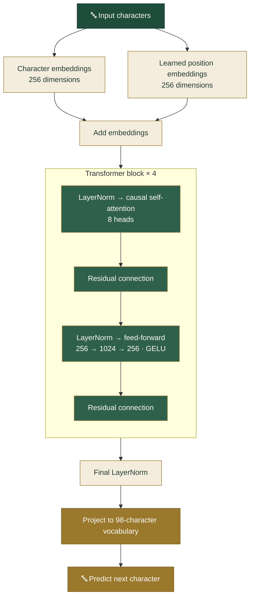
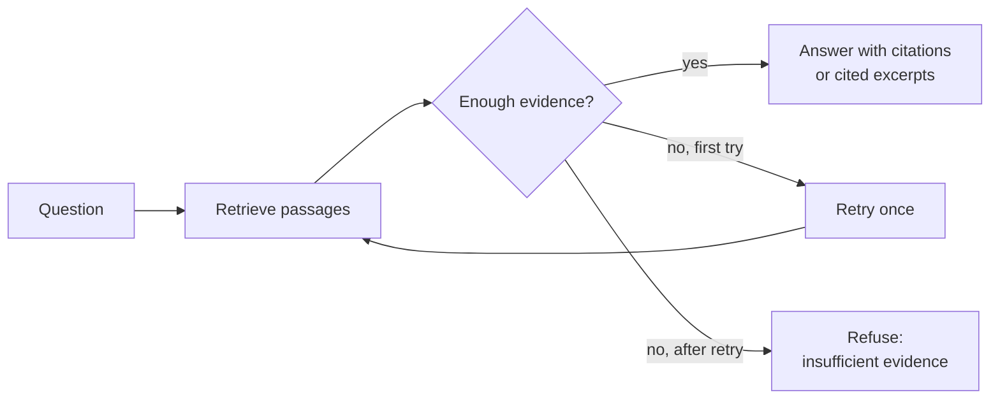

<div align="center">

# 🏛️ Dáil LLM

**Explore Irish parliamentary language through original debates, a character model, and separate research experiments.**

[](https://www.python.org/)
[](https://pytorch.org/)
[](https://dail-llm.vercel.app/)
[](#public-qa-status)
<br/>
[](#qa-tooling)
[](#qa-tooling)
[![Langfuse tracing][badge-langfuse]](#qa-tooling)

[**Open the site ↗**](https://dail-llm.vercel.app/) · [**Run locally**](#run-the-application) · [**See results**](#results) · [**Limitations**](#limitations)

</div>

---

## 📖 What this project is

Dáil LLM began as a character-level transformer written from scratch in PyTorch, trained on Irish parliamentary speeches to understand how these models actually work. It has since gained two companions: a way to ask questions of the real Official Report with links back to the original debate, and a separate research study of speech memory and historical change. The three are kept apart on purpose, each with its own data and its own claims.

| At a glance | |
| --- | --- |
| **In one line** | A small character model, a source-first debate search, and a research pilot, each documented with what it can and cannot show. |
| **The problem** | A model that writes fluent Dáil-style text says nothing reliable about what was actually said. Questions about the record need sources, and sometimes the right answer is "not enough evidence". |
| **The approach** | The character model stays a model of language, never a source of facts. Questions go through retrieval first: passages are found and checked, then answered with citations or refused. |
| **What is built** | Three surfaces (below), served by one FastAPI app and a React site. |
| **Status** | Model Lab and Research are live. Public debate search is release gated and currently switched off (see [Limitations](#limitations)). |

## 🧭 Three ways to explore

| Route | What it shows | Evidence |
| --- | --- | --- |
| [**Ask the debates**](https://dail-llm.vercel.app/ask) (`/ask`) | Retrieves speaker passages from the Oireachtas Official Report and links to the original debate | A local index of Dáil debate XML from 2014 onward; availability and coverage come from the connected API |
| [**Model Lab**](https://dail-llm.vercel.app/lab) (`/lab`) | Continues a prompt one character at a time and displays attention and evaluation results | A 3.27 million parameter model trained on 9,080 speeches dated 15 February–25 April 1950 |
| [**Research**](https://dail-llm.vercel.app/research) (`/research`) | Explores speech memory and historical comparisons | A separate CPU pilot using selected 2008–2011 debates |

The character model generates text but was never trained to answer questions, and the Research pilot uses a different dataset and checkpoint.

## 🗃️ Data and provenance

| Source | Used for | Scope |
| --- | --- | --- |
| [Harvard Dataverse archive](https://doi.org/10.7910/DVN/6MZN76) | Model Lab | The archive spans 1919–2013; the served checkpoint uses a selected ten-week period in 1950. |
| [Oireachtas Official Report](https://www.oireachtas.ie/en/debates/) | Ask the debates | The downloader collects Dáil debate XML from 2014 onward. Search coverage depends on the connected index. |
| Selected 2008–2011 debates | Research | A separate CPU pilot, with recorded examples available in the site. |

The [1950 manifest](outputs/dataset_manifest.json) records the selected dates, counts, and source hash. The [current-debate data card](docs/DATA_CARD.md) records one measured local snapshot and its gaps. Separately published parliamentary questions are outside the Dáil debate index.

<details>
<summary>See the 1950 corpus and split sizes</summary>

| Detail | Recorded value |
| --- | ---: |
| Clean text | 6,316,064 bytes; 6,295,637 characters |
| Train / validation / test | 5,666,073 / 314,782 / 314,781 characters |
| Minimum speech length | 50 characters |
| Maximum non-ASCII ratio | 40% per speech |

The non-ASCII threshold is **not** a language detector. Earlier debates contain more Irish-language material, and this selection does not represent the full archive.

</details>

**Archive citation:** Alexander Herzog and Slava J. Mikhaylov, *Database of Parliamentary Speeches in Ireland, 1919–2013*, Harvard Dataverse, [DOI 10.7910/DVN/6MZN76](https://doi.org/10.7910/DVN/6MZN76). Newer material comes from the Official Report under its [open-data licence](https://www.oireachtas.ie/en/open-data/license/) (Creative Commons Attribution 4.0).

## 🧠 How the character model works

`DailTransformerLM` is a decoder-only transformer written in PyTorch with no pretrained weights. It predicts one character from the preceding context, then feeds that character back in to continue the sequence.


```mermaid
flowchart TD
    classDef input fill:#1F4D3B,color:#fff,stroke:#15392B
    classDef layer fill:#F4ECDD,color:#203C31,stroke:#9B792C
    classDef core fill:#2F604B,color:#fff,stroke:#9B792C
    classDef output fill:#9B792C,color:#fff,stroke:#765B20

    A["🔤 Input characters"]:::input --> B["Character embeddings<br/>256 dimensions"]:::layer
    A --> C["Learned position embeddings<br/>256 dimensions"]:::layer
    B --> D["Add embeddings"]:::layer
    C --> D
    D --> E
    subgraph E["Transformer block × 4"]
      direction TB
      E1["LayerNorm → causal self-attention<br/>8 heads"]:::core --> E2["Residual connection"]:::core
      E2 --> E3["LayerNorm → feed-forward<br/>256 → 1024 → 256 · GELU"]:::core
      E3 --> E4["Residual connection"]:::core
    end
    E --> F["Final LayerNorm"]:::layer
    F --> G["Project to 98-character vocabulary"]:::output
    G --> H["🔤 Predict next character"]:::output
```

| Setting | Value |
| --- | --- |
| Context window | 256 characters |
| Layers / attention heads | 4 / 8 |
| Embedding / head size | 256 / 32 |
| Feed-forward width | 1,024 with GELU |
| Vocabulary | 98 characters, built from training text |
| Training | 2,000 steps; AdamW; learning rate 3e-4; batch size 32 |
| Dropout / evaluation interval | 0.1 within attention and feed-forward layers / every 200 steps |

The diagram follows the current [model implementation](dail_llm/model/transformer.py). A causal mask prevents each position from seeing later characters.

<a id="qa-tooling"></a>

## 🔎 How grounded Q&A works

Ask the debates answers only from what it retrieves. Each question is searched against an index of Official Report passages (a local SQLite full-text index, or free-tier Cloudflare D1 shards when connected). The evidence is graded, a failed search is retried once, and the result is either an answer with citations or a plain refusal. If no answer model is configured, or its citations do not check out against the retrieved passages, Ask returns the cited excerpts instead.


```mermaid
flowchart LR
    Q["Question"] --> R["Retrieve passages"]
    R --> G{"Enough evidence?"}
    G -->|yes| A["Answer with citations<br/>or cited excerpts"]
    G -->|no, first try| T["Retry once"] --> R
    G -->|no, after retry| X["Refuse:<br/>insufficient evidence"]
```

| Tool | Role here |
| --- | --- |
| **LangChain** | Wraps retrieved passages as documents through a retriever interface in the [Q&A flow](dail_llm/qa/answer.py). |
| **LangGraph** | Runs the retrieve, grade, retry, and answer or refuse steps in the [same flow](dail_llm/qa/answer.py). |
| **Langfuse** | Optional tracing. Callbacks and a prompt version are wired in and switch on only when both Langfuse keys are set. |

These tools belong to the debate Q&A path. The character model in Model Lab runs separately.

<a id="results"></a>

## 📊 Results

The served 1950 checkpoint, measured on held-out text. These are next-character prediction metrics, not factual accuracy. They come from the saved [evaluation](outputs/evaluation_results.json) and [dataset manifest](outputs/dataset_manifest.json).

| Metric | Value |
| --- | ---: |
| Speeches used | **9,080** (15 February–25 April 1950) |
| Parameters | **3,271,168** |
| Perplexity | **4.07** |
| Bits per character | **2.024** |
| Next-character accuracy | **58.67%** |
| Cross-entropy | **1.4030** |

| Other study | Observation | How to read it |
| --- | --- | --- |
| Research pilot, earlier split | Witten–Bell five-gram: **1.8572** bits/character; unconditioned decoder: **3.5646** | Lower is better **within this pilot**. Its scores cannot be compared directly with the served checkpoint's 2.024. |
| Speech memory and historical comparison | No clear speech-memory gain; one matched historical pair | The short CPU run and small comparison do not support a broader claim. |

[Pilot methods and limits](docs/pilot-results.md) · [Research reproduction guide](docs/research.md) · [Q&A evaluation record](eval/README.md).

<details>
<summary>🎙️ Generated samples (model output, not parliamentary quotations)</summary>

Generated with the saved checkpoint, seed 42, temperature 0.8, and 200 new characters per prompt. The odd phrasing is part of the result. [Raw results and settings](outputs/evaluation_results.json).

**“The Minister for”**
> The Minister for the lay pig. There arrangements who are in principles. I should like to this House did not use of bad and he can sit would be likely to develop that, but who is not raise some similar, goodwill any s

**“In this House”**
> In this House or the parties officer holiday, qualities of people of the Minister is already at the moment the promission, that is necessary. So far a line that the commission power is against the net pursue in th

**“The question before us”**
> The question before used the Dáil to call only be a decisions at the bagance that is impossible to civil servants abte the development of the cost of the words' that least was productly about the Dublin that the Bill the c

**“I wish to raise”**
> I wish to raise that agricultural wages throwners and I hope for it sub-section meet used for that matters are not being relieved, if we were to the complete when the State far a holiday of the land artificattion, o

**“On the matter of”**
> On the matter of this Bill commissioners. I will referred to find performed could have able to give the tribunal year and go in the concerned better the schedwer of a manufacturer. So that is pit at a largely whom a

</details>

## 📁 Project map

```text
dail_llm/
├── dail_llm/       Character model, FastAPI, Research, and Q&A code
├── frontend/       React site: Home, Ask, Lab, Research
├── scripts/        Incremental debate downloader and supporting scripts
├── eval/           Q&A questions, results, and release criteria
├── outputs/        Saved model evaluation and dataset manifest
├── docs/           Methods, data card, audit, and UI specification
├── infra/          Free-tier infrastructure proposal
└── tests/          Python API, data, and retrieval checks
```

Raw downloads, generated indices, and research run directories are ignored by Git. The recorded Research examples are checked in so that page remains inspectable without a live research service. [Research interface guide](docs/research-ui.md) · [UI design specification](docs/UI_DESIGN_SPEC.md).

<a id="run-the-application"></a>

## ⚙️ Run the application

You need Python **3.12 or newer** and Node.js with pnpm. The repository includes the served checkpoint, saved evaluation, and recorded Research examples. You do **not** need to download the historical archive just to browse the Lab and Research pages.

From the repository root:

```powershell
python -m pip install -e ".[research]"
cd frontend
pnpm install --frozen-lockfile
pnpm run build
cd ..
python -m dail_llm.api
```

Open `http://127.0.0.1:8000`. The compiled frontend is served by FastAPI. The Research page uses its recorded examples without a private research backend. For frontend development, run `pnpm run dev` in `frontend/` and use the Vite preview at `http://127.0.0.1:5173`; its `/api` requests proxy to port 8000.

Docker can build and serve the same application with `docker compose up --build`. Optional runtime settings are listed in [`.env.example`](.env.example). The private Research inspection bundle has its own [setup guide](docs/research-ui.md).

<details>
<summary>🔁 Reproduce the 1950 model</summary>

Download `Dail_debates_1919-2013.tab` from the [Harvard Dataverse record](https://doi.org/10.7910/DVN/6MZN76) and place it in `dataverse_files/`. Then run:

```powershell
python train_pipeline.py
```

This extracts the 1950 subset, builds the splits, trains, and evaluates. It skips extraction if `dataverse_files/dail_debates_clean.txt` already exists. Training takes substantially longer than opening the included checkpoint. The configuration is in [`dail_llm/config.py`](dail_llm/config.py); the resulting corpus manifest and evaluation are in [`outputs/`](outputs/).

</details>

<details>
<summary>🔎 Build the current-debate index</summary>

Install the Q&A dependencies, download Official Report XML, and build the local search index:

```powershell
python -m pip install -e ".[qa]"
python -m scripts.download_debates --start 2014-01-01
python -m dail_llm.qa.index
```

The downloader saves XML and a SHA-256 manifest under ignored `data/oireachtas/`; reruns reuse unchanged records. Use `--refresh` with a bounded date range to check for revised XML. The SQLite FTS index is `data/oireachtas/passages.sqlite`. Start the API again and `/ask` will report the coverage of that connected index. The [data card](docs/DATA_CARD.md) records one measured local snapshot, its gaps, and the source-link rules.

</details>

### API and checks

FastAPI serves the built React site at `/`. The interactive endpoint list is at `/api/docs` when the server is running.

| Endpoint | Purpose |
| --- | --- |
| `GET /api/v1/health`, `GET /api/v1/model` | Service health and model metadata |
| `POST /api/v1/generate`, `POST /api/v1/attention` | Character generation and attention weights |
| `GET /api/v1/evaluation` | Saved checkpoint evaluation |
| `GET /api/v1/research/capabilities`, `POST /api/v1/research/inspect` | Research availability and optional live inspection |
| `GET /api/v1/qa/capabilities`, `POST /api/v1/qa/ask` | Debate index coverage and grounded Q&A |

Run these checks from the repository root:

```powershell
python -m pip install -e ".[dev,research,qa]"
python -m ruff check dail_llm tests scripts
python -m pytest -q -m "not integration"
cd frontend
pnpm run lint
pnpm run test
pnpm run build
pnpm run test:e2e
```

The browser suite uses mocked Q&A responses, so passing it does not prove that public search is deployed. [Verification record](docs/ui-verification.md) · [Repository audit](docs/AUDIT.md).

<a id="limitations"></a>

## ⚠️ Limitations

**Model Lab (the character model)**

- It predicts characters, not facts. Its output can be incoherent or wrong, and the evaluation measures prediction rather than truth.
- It was trained on a small slice: ten weeks of 1950 (9,080 speeches, 3.27 million parameters, a 256-character context). It does not represent the 1919–2013 archive or modern debate.
- The non-ASCII filter is not a language detector, so language filtering is approximate.
- Its five saved samples contain no repeated word trigrams, but that small check does not show the model cannot repeat or loop.

<a id="public-qa-status"></a>

**Ask the debates**

- Public search is release gated. At the last check, the live site's Q&A API reported no debate index (`available: false`), so the Ask page disables search. A local index enables it on a local deployment.
- Launch still needs citation review, an independently checked evaluation set, and free-tier sizing. The 52 current evaluation candidates are unreviewed and easier than real questions, and the Cloudflare D1 pilot holds only 30 passages. See the [evaluation record](eval/README.md) and [infrastructure notes](infra/README.md).
- Retrieved passages show what speakers said, not whether it was true.
- Coverage depends on the connected index: Official Report debates from 2014 onward, without separately published parliamentary questions.

**Research**

- The pilot is a short CPU run on selected 2008–2011 debates with one training seed. It shows no clear speech-memory gain, finds only one matched historical pair, and its five-gram baseline beats the briefly trained decoders. Treat it as exploratory. [Pilot results](docs/pilot-results.md).

**Not done yet**

- No Langfuse cloud trace or LangSmith experiment has been recorded. Both need credentials, and LangSmith also needs a human-reviewed question set.
- The Terraform description of free-tier Cloudflare D1 shards has been planned offline but never applied.

---

**Author:** Abinash Prasana Selvanathan

<!-- shields.io has no Langfuse icon, so the badge embeds the official one from the langfuse/langfuse repository (web/public/icon.svg). -->
[badge-langfuse]: https://img.shields.io/badge/Langfuse-Wired-9B792C?style=for-the-badge&logo=data%3Aimage%2Fsvg%2Bxml%3Bbase64%2CPHN2ZyB4bWxucz0iaHR0cDovL3d3dy53My5vcmcvMjAwMC9zdmciIHZpZXdCb3g9IjQ4IDQ4IDQxNiA0MTYiPjxwYXRoIGQ9Ik0yNTUgMzAyTDI4NSAzMjdDMjg1IDMyNyAzMDkgMzA5IDMyNiAzMDdDMzQ0IDMwNCAzNjMgMzE0IDM4MSAzMjZDNDA4IDM0NCA0MzAgMzY3IDQzMCAzNjdMNDU3IDM0MUM0NTcgMzQxIDM4NCAyNjIgMzI2IDI2OUMyODggMjc0IDI1NSAzMDIgMjU1IDMwMlpNMjU2IDIwOUwyODUgMTg1QzI4NSAxODUgMzA5IDIwMiAzMjYgMjA1QzM0NCAyMDcgMzYzIDE5NyAzODEgMTg1QzQwOCAxNjcgNDMwIDE0NCA0MzAgMTQ0TDQ1NyAxNzBDNDU3IDE3MCAzODQgMjQ5IDMyNiAyNDJDMjg4IDIzOCAyNTYgMjA5IDI1NiAyMDlaTTE4NiAxMzBDMjI0IDEzMCAyNTUgMTYyIDI1NSAxNjJDMjU1IDE2MiAyNDYgMTY5IDI0MSAxNzRDMjM1IDE3OSAyMjUgMTg2IDIyNSAxODZDMjI1IDE4NiAyMDkgMTY5IDE4NiAxNjlDMTc3IDE2OSAxNjUgMTc0IDE1MiAxODVDMTQyIDE5NCAxMzIgMjA0IDEyNSAyMTdDMTE5IDIyOSAxMTYgMjQyIDExNiAyNTZDMTE1IDI3MyAxMjIgMjkyIDEzMiAzMDZDMTM5IDMxNiAxNDcgMzIzIDE1NSAzMzBDMTY2IDMzOCAxNzggMzQ0IDE4NiAzNDRDMTk1IDM0NCAyMDMgMzQxIDIwOSAzMzhDMjE5IDMzMiAyMjYgMzI2IDIyNiAzMjZMMjU2IDM1MEMyNTYgMzUwIDI0NCAzNjIgMjI3IDM3MUMyMTcgMzc3IDIwMyAzODIgMTg2IDM4MkMxNzAgMzgyIDE1MCAzNzMgMTMyIDM1OUMxMjEgMzUwIDEwOSAzNDAgMTAwIDMyN0M4NiAzMDYgNzggMjgxIDc4IDI1NkM3OCAyMzAgODcgMjA1IDEwMSAxODRDMTI0IDE1NCAxNTggMTMwIDE4NiAxMzBaIiBmaWxsPSIjRkY1RDVGIi8%2BPHBhdGggZD0iTTgwIDE1MUw1NSAxNzlDNTUgMTc5IDEyNSAyNDQgMTgwIDI0NEMyMDUgMjQ0IDIzOSAyMjQgMjY5IDE5OUMyODYgMTg0IDMwNSAxNjggMzI0IDE2OEMzMzcgMTY4IDM1NCAxNzUgMzcwIDE5MkMzNzAgMTkyIDM4MCAxODYgMzg2IDE4MkMzOTIgMTc4IDQwMCAxNzEgNDAwIDE3MUMzNzcgMTQ3IDM0NCAxMjkgMzI0IDEzMUMyOTIgMTMxIDI2OSAxNTEgMjQxIDE3NEMyMTIgMTk3IDIwMCAyMDYgMTgwIDIwNkMxNDUgMjA2IDgwIDE1MSA4MCAxNTFaTTgwIDM2MUw1NSAzMzNDNTUgMzMzIDEyNSAyNjggMTgwIDI2OEMyMDUgMjY4IDIzOSAyODggMjY5IDMxM0MyODYgMzI4IDMwNSAzNDQgMzI0IDM0NEMzMzcgMzQ0IDM1NCAzMzcgMzcwIDMxOUMzNzAgMzE5IDM3OSAzMjUgMzg1IDMyOUMzOTEgMzMzIDQwMCAzNDAgNDAwIDM0MEMzNzcgMzY1IDM0NCAzODMgMzI0IDM4MUMyOTIgMzgxIDI3MyAzNjQgMjQ1IDM0MUMyMTYgMzE4IDIwMCAzMDYgMTgwIDMwNkMxNDUgMzA2IDgwIDM2MSA4MCAzNjFaTTQwNiAyMTNDNDAwIDIxOCAzODkgMjI0IDM4OSAyMjRDMzg5IDIyNCAzOTUgMjM3IDM5NSAyNTVDMzk1IDI3MiAzOTAgMjg3IDM5MCAyODdDMzkwIDI4NyAzOTkgMjkzIDQwNSAyOTdDNDEyIDMwMiA0MjEgMzA5IDQyMSAzMDlDNDIxIDMwOSA0MzMgMjg1IDQzMyAyNTVDNDMzIDIyNSA0MjEgMjAyIDQyMSAyMDJDNDIxIDIwMiA0MTIgMjA5IDQwNiAyMTNaIiBmaWxsPSIjNEU5Q0ZGIi8%2BPC9zdmc%2B
