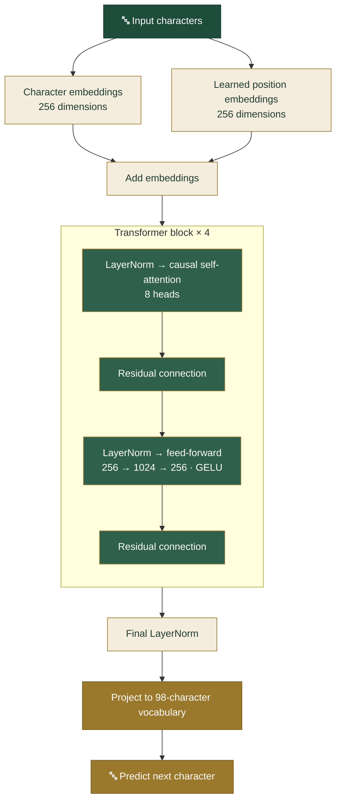

<div align="center">

# 🏛️ Dáil LLM

**Explore Irish parliamentary language through original debates, a character model, and separate research experiments.**

[](https://www.python.org/)
[](https://pytorch.org/)
[](https://dail-llm.vercel.app/)
[](#public-qa-status)
<br/>
[](#qa-tooling)
[](#qa-tooling)
[![Langfuse tracing][badge-langfuse]](#qa-tooling)

[**Open the site ↗**](https://dail-llm.vercel.app/) · [**Run locally**](#run-the-application) · [**See results**](#results-and-limits) · [**Tool status**](#qa-tooling)

</div>

---

## 📖 Three ways to explore

| Route | What it shows | Evidence |
| --- | --- | --- |
| [**Ask the debates**](https://dail-llm.vercel.app/ask) (`/ask`) | Retrieves speaker passages from the Oireachtas Official Report and links to the original debate | A local index of Dáil debate XML from 2014 onward; availability and coverage come from the connected API |
| [**Model Lab**](https://dail-llm.vercel.app/lab) (`/lab`) | Continues a prompt one character at a time and displays attention and evaluation results | A 3.27 million parameter model trained on 9,080 speeches dated 15 February–25 April 1950 |
| [**Research**](https://dail-llm.vercel.app/research) (`/research`) | Explores speech memory and historical comparisons | A separate CPU pilot using selected 2008–2011 debates |

The public site serves Home, Model Lab, Research, and `/ask`. In the last verified deployment check, its Q&A API reported no public debate index, so the Ask page disabled search. A local index can enable it on a local deployment. Public Q&A still needs citation review, an independently checked evaluation, and free-tier sizing before launch. [See the release criteria](eval/README.md).

The character model generates text but was never trained to answer questions. The Research pilot uses a different dataset and checkpoint. Ask the debates retrieves sources and only generates an answer when evidence and the connected service allow it.

## ⚡ At a glance

| Served character model | Recorded value |
| --- | ---: |
| Speeches used | **9,080** from 15 February–25 April 1950 |
| Parameters | **3,271,168** |
| Held-out perplexity | **4.07** |
| Held-out bits per character | **2.024** |
| Next-character accuracy | **58.67%** |

These are next-character prediction metrics, not factual accuracy. They come from the saved [evaluation](outputs/evaluation_results.json) and [dataset manifest](outputs/dataset_manifest.json).

## 🗃️ Data and provenance

| Source | Used for | Scope |
| --- | --- | --- |
| [Harvard Dataverse archive](https://doi.org/10.7910/DVN/6MZN76) | Model Lab | The archive spans 1919–2013; the served checkpoint uses a selected ten-week period in 1950. |
| [Oireachtas Official Report](https://www.oireachtas.ie/en/debates/) | Ask the debates | The downloader collects Dáil debate XML from 2014 onward. Search coverage depends on the connected index. |
| Selected 2008–2011 debates | Research | A separate CPU pilot, with recorded examples available in the site. |

The [1950 manifest](outputs/dataset_manifest.json) records the selected dates, counts, and source hash. The [current-debate data card](docs/DATA_CARD.md) records one measured local snapshot and its gaps. Separately published parliamentary questions are outside the Dáil debate index.

<details>
<summary>See the 1950 corpus and split sizes</summary>

| Detail | Recorded value |
| --- | ---: |
| Clean text | 6,316,064 bytes; 6,295,637 characters |
| Train / validation / test | 5,666,073 / 314,782 / 314,781 characters |
| Minimum speech length | 50 characters |
| Maximum non-ASCII ratio | 40% per speech |

The non-ASCII threshold is **not** a language detector. Earlier debates contain more Irish-language material, and this selection does not represent the full archive.

</details>

**Archive citation:** Alexander Herzog and Slava J. Mikhaylov, *Database of Parliamentary Speeches in Ireland, 1919–2013*, Harvard Dataverse, [DOI 10.7910/DVN/6MZN76](https://doi.org/10.7910/DVN/6MZN76). Newer material comes from the Official Report under its [open-data licence](https://www.oireachtas.ie/en/open-data/license/) (Creative Commons Attribution 4.0).

## 🧠 How the character model works

`DailTransformerLM` is a decoder-only transformer written in PyTorch with no pretrained weights. It predicts one character from the preceding context, then feeds that character back in to continue the sequence.


```mermaid
flowchart TD
    classDef input fill:#1F4D3B,color:#fff,stroke:#15392B
    classDef layer fill:#F4ECDD,color:#203C31,stroke:#9B792C
    classDef core fill:#2F604B,color:#fff,stroke:#9B792C
    classDef output fill:#9B792C,color:#fff,stroke:#765B20

    A["🔤 Input characters"]:::input --> B["Character embeddings<br/>256 dimensions"]:::layer
    A --> C["Learned position embeddings<br/>256 dimensions"]:::layer
    B --> D["Add embeddings"]:::layer
    C --> D
    D --> E
    subgraph E["Transformer block × 4"]
      direction TB
      E1["LayerNorm → causal self-attention<br/>8 heads"]:::core --> E2["Residual connection"]:::core
      E2 --> E3["LayerNorm → feed-forward<br/>256 → 1024 → 256 · GELU"]:::core
      E3 --> E4["Residual connection"]:::core
    end
    E --> F["Final LayerNorm"]:::layer
    F --> G["Project to 98-character vocabulary"]:::output
    G --> H["🔤 Predict next character"]:::output
```

| Setting | Value |
| --- | --- |
| Context window | 256 characters |
| Layers / attention heads | 4 / 8 |
| Embedding / head size | 256 / 32 |
| Feed-forward width | 1,024 with GELU |
| Vocabulary | 98 characters, built from training text |
| Training | 2,000 steps; AdamW; learning rate 3e-4; batch size 32 |
| Dropout / evaluation interval | 0.1 within attention and feed-forward layers / every 200 steps |

The diagram follows the current [model implementation](dail_llm/model/transformer.py). A causal mask prevents each position from seeing later characters.

<a id="results-and-limits"></a>

## 📊 Results and limits

| Study | Observation | How to read it |
| --- | --- | --- |
| Served 1950 checkpoint | **4.07** perplexity; **2.024** bits/character; **58.67%** next-character accuracy | Held-out character prediction. It does not test whether generated statements are true. |
| Research pilot, earlier split | Witten–Bell five-gram: **1.8572** bits/character; unconditioned decoder: **3.5646** | Lower is better **within this pilot**. Its scores cannot be compared directly with the served checkpoint's 2.024. |
| Speech-memory and historical comparisons | No clear speech-memory gain; one matched historical pair | The short CPU run and small comparison do not support a broader claim. |

The character model can produce broken or incorrect prose. Retrieved debate passages show what speakers said, not whether their claims were true. When answer generation is unavailable, Ask returns cited excerpts. [Pilot methods and limits](docs/pilot-results.md) · [Research reproduction guide](docs/research.md) · [Q&A evaluation record](eval/README.md).

The served checkpoint's held-out cross-entropy is **1.4030**. Its five saved samples contain no repeated word trigrams, but that small check does not mean the model cannot repeat or loop. [See every recorded metric](outputs/evaluation_results.json).

### 🎙️ Generated samples

These are model output, **not** parliamentary quotations. They were generated with the saved checkpoint, seed 42, temperature 0.8, and 200 new characters per prompt. The odd phrasing is part of the result. [Raw results and settings](outputs/evaluation_results.json).

<details>
<summary>Prompt: “The Minister for”</summary>

> The Minister for the lay pig. There arrangements who are in principles. I should like to this House did not use of bad and he can sit would be likely to develop that, but who is not raise some similar, goodwill any s

</details>

<details>
<summary>Prompt: “In this House”</summary>

> In this House or the parties officer holiday, qualities of people of the Minister is already at the moment the promission, that is necessary. So far a line that the commission power is against the net pursue in th

</details>

<details>
<summary>Prompt: “The question before us”</summary>

> The question before used the Dáil to call only be a decisions at the bagance that is impossible to civil servants abte the development of the cost of the words' that least was productly about the Dublin that the Bill the c

</details>

<details>
<summary>Prompt: “I wish to raise”</summary>

> I wish to raise that agricultural wages throwners and I hope for it sub-section meet used for that matters are not being relieved, if we were to the complete when the State far a holiday of the land artificattion, o

</details>

<details>
<summary>Prompt: “On the matter of”</summary>

> On the matter of this Bill commissioners. I will referred to find performed could have able to give the tribunal year and go in the concerned better the schedwer of a manufacturer. So that is pit at a largely whom a

</details>

<a id="run-the-application"></a>

## ⚙️ Run the application

You need Python **3.12 or newer** and Node.js with pnpm. The repository includes the served checkpoint, saved evaluation, and recorded Research examples. You do **not** need to download the historical archive just to browse the Lab and Research pages.

From the repository root:

```powershell
python -m pip install -e ".[research]"
cd frontend
pnpm install --frozen-lockfile
pnpm run build
cd ..
python -m dail_llm.api
```

Open `http://127.0.0.1:8000`. The compiled frontend is served by FastAPI. The Research page uses its recorded examples without a private research backend. For frontend development, run `pnpm run dev` in `frontend/` and use the Vite preview at `http://127.0.0.1:5173`; its `/api` requests proxy to port 8000.

Docker can build and serve the same application with `docker compose up --build`. Optional runtime settings are listed in [`.env.example`](.env.example). The private Research inspection bundle has its own [setup guide](docs/research-ui.md).

<details>
<summary>🔁 Reproduce the 1950 model</summary>

Download `Dail_debates_1919-2013.tab` from the [Harvard Dataverse record](https://doi.org/10.7910/DVN/6MZN76) and place it in `dataverse_files/`. Then run:

```powershell
python train_pipeline.py
```

This extracts the 1950 subset, builds the splits, trains, and evaluates. It skips extraction if `dataverse_files/dail_debates_clean.txt` already exists. Training takes substantially longer than opening the included checkpoint. The configuration is in [`dail_llm/config.py`](dail_llm/config.py); the resulting corpus manifest and evaluation are in [`outputs/`](outputs/).

The extractor keeps speeches of at least 50 characters and excludes speeches with more than 40% non-ASCII characters. That threshold is **not** a language detector. The original archive covers 1919–2013, while this checkpoint uses only ten weeks in 1950. The repository's [dataset manifest](outputs/dataset_manifest.json) records the actual selected dates, speech count, and source hash.

</details>

<details>
<summary>🔎 Build the current-debate index</summary>

Install the Q&A dependencies, download Official Report XML, and build the local search index:

```powershell
python -m pip install -e ".[qa]"
python -m scripts.download_debates --start 2014-01-01
python -m dail_llm.qa.index
```

The downloader saves XML and a SHA-256 manifest under ignored `data/oireachtas/`; reruns reuse unchanged records. Use `--refresh` with a bounded date range to check for revised XML. The SQLite FTS index is `data/oireachtas/passages.sqlite`. Start the API again and `/ask` will report the coverage of that connected index. The [data card](docs/DATA_CARD.md) records one measured local snapshot, its gaps, and the source-link rules. Separately published parliamentary questions are outside this debate index.

</details>

## 📁 Project map

```text
dail_llm/
├── dail_llm/       Character model, FastAPI, Research, and Q&A code
├── frontend/       React site: Home, Ask, Lab, Research
├── scripts/        Incremental debate downloader and supporting scripts
├── eval/           Q&A questions, results, and release criteria
├── outputs/        Saved model evaluation and dataset manifest
├── docs/           Methods, data card, audit, and UI specification
├── infra/          Free-tier infrastructure proposal
└── tests/          Python API, data, and retrieval checks
```

Raw downloads, generated indices, and research run directories are ignored by Git. The recorded Research examples are checked in so that page remains inspectable without a live research service. [Research interface guide](docs/research-ui.md) · [UI design specification](docs/UI_DESIGN_SPEC.md).

<a id="qa-tooling"></a>

## 🧩 Tools behind Q&A

| Tool | What it does here | Status |
| --- | --- | --- |
| **LangChain** | Wraps retrieved passages as documents through a retriever interface in the [Q&A flow](dail_llm/qa/answer.py). | Used by local Q&A. |
| **LangGraph** | Runs retrieval, one retry, evidence checking, and answer or refusal in the [same flow](dail_llm/qa/answer.py). | Used by local Q&A. |
| **Langfuse** | Has callbacks and a prompt version wired into that flow. | No cloud trace recorded; credentials are still needed. |
| **LangSmith** | Has a [named evaluation path](scripts/evaluate_qa.py) that requires independently reviewed questions. | No experiment run yet. It needs a `LANGSMITH_API_KEY` and a human-reviewed question set; all 52 current candidates are unreviewed, so the upload refuses them. |
| **Terraform** | Describes proposed free-tier D1 resources in [`infra/`](infra/README.md). | Formatted, validated, and planned offline; never applied. Applying creates databases in a real Cloudflare account, so it waits for a scoped API token and the owner's explicit approval. |

These tools belong to the debate Q&A path. The character model in Model Lab runs separately. See [Q&A evaluation status](eval/README.md) and [infrastructure measurements](infra/README.md) for the remaining release work.

## 🔌 API and checks

FastAPI serves the built React site at `/`. The interactive endpoint list is at `/api/docs` when the server is running.

| Endpoint | Purpose |
| --- | --- |
| `GET /api/v1/health`, `GET /api/v1/model` | Service health and model metadata |
| `POST /api/v1/generate`, `POST /api/v1/attention` | Character generation and attention weights |
| `GET /api/v1/evaluation` | Saved checkpoint evaluation |
| `GET /api/v1/research/capabilities`, `POST /api/v1/research/inspect` | Research availability and optional live inspection |
| `GET /api/v1/qa/capabilities`, `POST /api/v1/qa/ask` | Debate index coverage and grounded Q&A |

Run these checks from the repository root:

```powershell
python -m pip install -e ".[dev,research,qa]"
python -m ruff check dail_llm tests scripts
python -m pytest -q -m "not integration"
cd frontend
pnpm run lint
pnpm run test
pnpm run build
pnpm run test:e2e
```

The browser suite uses mocked Q&A responses and covers responsive layouts, keyboard use, reduced motion, and the Research views. Passing it does not prove that public search is deployed. [Verification record](docs/ui-verification.md) · [Repository audit](docs/AUDIT.md).

<a id="public-qa-status"></a>

### Public Q&A status

The [infrastructure notes](infra/README.md) describe a free Cloudflare D1 pilot with **30 passages** for checking search, direct links, and Irish fadas. That pilot is not the complete corpus. Terraform describes proposed free-tier resources and has not been applied. Langfuse tracing and LangSmith experiments still need credentials and a reviewed evaluation set. The public Ask page must use the connected API's actual coverage; it does not claim that the larger local corpus is online.

---

**Author:** Abinash Prasana Selvanathan

<!-- shields.io has no Langfuse icon, so the badge embeds the official one from the langfuse/langfuse repository (web/public/icon.svg). -->
[badge-langfuse]: https://img.shields.io/badge/Langfuse-Wired-9B792C?style=for-the-badge&logo=data%3Aimage%2Fsvg%2Bxml%3Bbase64%2CPHN2ZyB3aWR0aD0iNTEyIiBoZWlnaHQ9IjUxMiIgdmlld0JveD0iNDggNDggNDE2IDQxNiIgZmlsbD0ibm9uZSIgeG1sbnM9Imh0dHA6Ly93d3cudzMub3JnLzIwMDAvc3ZnIj48cGF0aCBkPSJNMjU0Ljc1IDMwMi4yNUwyODUuMjUgMzI2Ljc1QzI4NS4yNSAzMjYuNzUgMzA4LjU4NyAzMDkuNDE4IDMyNS43NSAzMDYuODc1QzM0My43NSAzMDQuMjA4IDM2Mi45NTQgMzE0LjI0NCAzODAuNzUgMzI2LjIwOEM0MDcuNjI5IDM0NC4yNzkgNDMwLjI1IDM2Ny4yMDggNDMwLjI1IDM2Ny4yMDhMNDU2Ljc1IDM0MS4yMDhDNDU2Ljc1IDM0MS4yMDggMzgzLjY4NiAyNjIuMDQ3IDMyNS43NSAyNjkuMjA4QzI4Ny43NSAyNzMuOTA1IDI1NC43NSAzMDIuMjUgMjU0Ljc1IDMwMi4yNVoiIGZpbGw9IiNGRjVENUYiLz48cGF0aCBkPSJNODAuMjUgMTUxLjI4Nkw1NS4yNSAxNzguNzg2QzU1LjI1IDE3OC43ODYgMTI0LjkwMiAyNDMuNzg2IDE3OS43NSAyNDMuNzg2QzIwNC43NSAyNDMuNzg2IDIzOS40MTkgMjI0LjIwMSAyNjkuMjUgMTk4Ljc1N0MyODYuMjUgMTg0LjI1NyAzMDUuMjUgMTY3Ljc4NiAzMjQuMjUgMTY3Ljc4NkMzMzcuMDIxIDE2Ny43ODYgMzUzLjg2NiAxNzQuNTUxIDM2OS43NSAxOTIuMzE2QzM2OS43NSAxOTIuMzE2IDM4MC4wMDMgMTg2LjE2OCAzODYuMjUgMTgxLjc1QzM5MS43NCAxNzcuODY4IDM5OS44OTYgMTcxLjI1IDM5OS44OTYgMTcxLjI1QzM3Ny4wNDcgMTQ2Ljg2NCAzNDMuOTk4IDEyOS4wMzggMzI0LjI1IDEzMC43ODZDMjkyLjI1IDEzMC43OSAyNjkuMjUgMTUwLjcxMSAyNDAuNzUgMTczLjc1QzIxMi4yNSAxOTYuNzg5IDIwMC4yNSAyMDYuMjg2IDE3OS43NSAyMDYuMjg2QzE0NS4yNSAyMDYuMjg2IDgwLjI1IDE1MS4yODYgODAuMjUgMTUxLjI4NloiIGZpbGw9IiM0RTlDRkYiLz48cGF0aCBkPSJNODAuMjUgMzYwLjc1TDU1LjI1IDMzMy4yNUM1NS4yNSAzMzMuMjUgMTI0LjkwMiAyNjguMjUgMTc5Ljc1IDI2OC4yNUMyMDQuNzUgMjY4LjI1IDIzOS40MTkgMjg3LjgzNSAyNjkuMjUgMzEzLjI3OUMyODYuMjUgMzI3Ljc3OSAzMDUuMjUgMzQ0LjI1IDMyNC4yNSAzNDQuMjVDMzM3LjA4MyAzNDQuMjUgMzUzLjc5OSAzMzcuMjA3IDM2OS43NSAzMTkuMjVDMzY5Ljc1IDMxOS4yNSAzNzkuMzM5IDMyNS4xNjEgMzg1LjI1IDMyOS4yNUMzOTEuMzI4IDMzMy40NTUgNDAwLjI1IDM0MC40MDcgNDAwLjI1IDM0MC40MDdDMzc3LjM5IDM2NC45ODcgMzQ0LjEgMzgzLjAwNyAzMjQuMjUgMzgxLjI1QzI5Mi4yNSAzODEuMjQ2IDI3My4yNSAzNjQuMjg5IDI0NC43NSAzNDEuMjVDMjE2LjI1IDMxOC4yMTEgMjAwLjI1IDMwNS43NSAxNzkuNzUgMzA1Ljc1QzE0NS4yNSAzMDUuNzUgODAuMjUgMzYwLjc1IDgwLjI1IDM2MC43NVoiIGZpbGw9IiM0RTlDRkYiLz48cGF0aCBkPSJNNDA2LjI1IDIxMy4yNUMzOTkuNzQ1IDIxNy43NDYgMzg5LjI1IDIyNC4yNSAzODkuMjUgMjI0LjI1QzM4OS4yNSAyMjQuMjUgMzk1LjI1IDIzNy4yNSAzOTUuMjUgMjU0Ljc1QzM5NS4yNSAyNzIuMjUgMzg5Ljc1IDI4Ny4yNSAzODkuNzUgMjg3LjI1QzM4OS43NSAyODcuMjUgMzk5LjE3MiAyOTMuMTM1IDQwNS4yNSAyOTcuMjVDNDExLjU2NCAzMDEuNTI1IDQyMS4yNSAzMDguNzUgNDIxLjI1IDMwOC43NUM0MjEuMjUgMzA4Ljc1IDQzMi43NSAyODQuNzUgNDMyLjc1IDI1NC43NUM0MzIuNzUgMjI0Ljc1IDQyMS4yNSAyMDIuMjUgNDIxLjI1IDIwMi4yNUM0MjEuMjUgMjAyLjI1IDQxMi4yMjYgMjA5LjEyIDQwNi4yNSAyMTMuMjVaIiBmaWxsPSIjNEU5Q0ZGIi8%2BPHBhdGggZD0iTTI1Ni4yNSAyMDkuMjVMMjg1LjI1IDE4NS4yNUMyODUuMjUgMTg1LjI1IDMwOC41ODcgMjAyLjA0IDMyNS43NSAyMDQuNTgzQzM0My43NSAyMDcuMjUgMzYyLjk1NCAxOTcuMjE0IDM4MC43NSAxODUuMjVDNDA3LjYyOSAxNjcuMTc5IDQzMC4yNSAxNDQuMjUgNDMwLjI1IDE0NC4yNUw0NTYuNzUgMTcwLjI1QzQ1Ni43NSAxNzAuMjUgMzgzLjY4NiAyNDkuNDExIDMyNS43NSAyNDIuMjVDMjg3Ljc1IDIzNy41NTMgMjU2LjI1IDIwOS4yNSAyNTYuMjUgMjA5LjI1WiIgZmlsbD0iI0ZGNUQ1RiIvPjxwYXRoIGQ9Ik0xODYuMjU1IDEzMC4yNUMyMjMuNzU1IDEzMC4yNSAyNTUuMjUgMTYyLjI1IDI1NS4yNSAxNjIuMjVDMjU1LjI1IDE2Mi4yNSAyNDYuNDg3IDE2OS4xNTUgMjQwLjc1IDE3My43NUMyMzQuNzc1IDE3OC41MzYgMjI1LjI1IDE4Ni4yNSAyMjUuMjUgMTg2LjI1QzIyNS4yNSAxODYuMjUgMjA4Ljc1NSAxNjguNzUgMTg2LjI1NSAxNjguNzVDMTc3LjAyOCAxNjguNzUgMTY1LjAzOSAxNzQuMjkyIDE1Mi4yNTUgMTg1LjI1QzE0Mi4zOTEgMTkzLjcwNSAxMzIuMTI5IDIwNC4yMTYgMTI1LjI1NSAyMTcuMjVDMTE5LjMxIDIyOC41MiAxMTYuMDY4IDI0MS44MDIgMTE1Ljc1NSAyNTUuNzVDMTE1LjM2MSAyNzMuMjY5IDEyMS41NzEgMjkxLjYzNCAxMzEuNzU1IDMwNi4yNUMxMzguNTggMzE2LjA0NiAxNDYuNzI2IDMyMy40MTggMTU1LjI1NSAzMjkuNzVDMTY2LjMyMyAzMzcuOTY4IDE3Ny44NjUgMzQzLjc1IDE4Ni4yNTUgMzQzLjc1QzE5NS4yMTcgMzQzLjc1IDIwMy4yNzQgMzQwLjYzNSAyMDkuMjU1IDMzNy43NUMyMTguNzU1IDMzMi4yNSAyMjYuMjUgMzI1Ljc1IDIyNi4yNSAzMjUuNzVMMjU1Ljc1IDM1MC4yNUMyNTUuNzUgMzUwLjI1IDI0My43NSAzNjIuMjUgMjI3LjI1NSAzNzEuMjVDMjE2LjU5NSAzNzYuNTA3IDIwMi44OTUgMzgxLjc1IDE4Ni4yNTUgMzgxLjc1QzE2OS42MjYgMzgxLjc1IDE1MC4zMTUgMzcyLjkxNSAxMzIuMjU1IDM1OS4yNUMxMjAuNTc5IDM1MC40MTYgMTA5LjEzNSAzMzkuOTQ4IDEwMC4yNTUgMzI3LjI1Qzg1LjcwMDUgMzA2LjQzOCA3OC4yMDA0IDI4MS4xMTggNzguMjUwMiAyNTUuNzVDNzguMzAwOCAyMzAuMDY1IDg2LjU4MjMgMjA0LjYyNSAxMDEuMjU1IDE4My43NUMxMjQuMjU1IDE1My43NSAxNTguMjczIDEzMC4yNSAxODYuMjU1IDEzMC4yNVoiIGZpbGw9IiNGRjVENUYiLz48L3N2Zz4%3D
